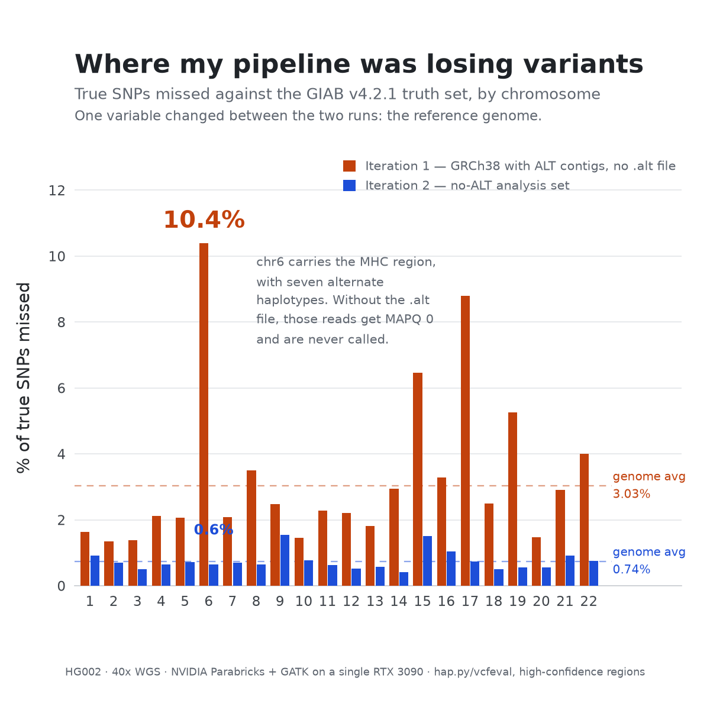

# GPU whole-genome variant calling on consumer hardware

An end-to-end HG002 germline pipeline built to answer one practical question:
can a full human genome be analysed accurately on hardware a researcher could
actually own?

The answer was yes. NVIDIA Parabricks processed a 40× HG002 whole genome on a
single RTX 3090 connected to a laptop over OcuLink in **10 h 31 m**. Against the
GIAB v4.2.1 truth set, the final call set reached **0.9921 SNP F1** and
**0.9924 INDEL F1**.

## Results at a glance

| System | Configuration |
|---|---|
| Sample | HG002, NovaSeq PCR-free, 40× |
| GPU | RTX 3090 24 GB, external OcuLink PCIe dock |
| Host | Ryzen 5 6600H, 31 GB RAM, 10 WSL2 threads |
| Software | Parabricks 4.7.0-1, GRCh38 no-ALT + hs38d1 |
| Pipeline | `fq2bam → bqsr → haplotypecaller → genotypegvcf` |
| End-to-end runtime | **10 h 31 m** |
| GIAB accuracy | **SNP F1 0.9921 · INDEL F1 0.9924** |


The host was far below NVIDIA's recommended 100 GB RAM and 24 CPU threads for
a single-GPU system. The run remained stable by using Parabricks' low-memory
paths, limiting the BWA queue, separating alignment from BQSR so memory was
released between phases, and keeping large intermediate files in a Linux Docker
volume.

## The important debugging result: ALT contigs

The first run used Broad's GRCh38 reference with 261 ALT contigs but without
the companion `.alt` file. BWA therefore treated reads mapping to a primary
locus and its alternate scaffold as ordinary multi-mappers, assigned MAPQ 0,
and caused HaplotypeCaller to discard them.

Switching to the NCBI **no-ALT + hs38d1** analysis set fixed the failure mode:

| Metric | ALT contigs, no `.alt` | No-ALT reference |
|---|---:|---:|
| SNP recall | 96.97% | **99.26%** |
| SNP false negatives | 101,963 | **24,740** |
| MHC SNP recall | 1.49% | **97.43%** |
| SNP F1 | 0.9814 | **0.9921** |
| INDEL F1 | 0.9837 | **0.9924** |



This was the main scientific lesson of the project: a reference/index mismatch
can look like a caller-quality problem while silently removing nearly every true
variant in a medically important region.

## GPU versus CPU

Both paths were measured on the same machine. Alignment used 10 million read
pairs; variant calling used `chr20:1-20 Mb` from the full-coverage BAM.

| Workload | RTX 3090 | CPU, 10 threads | Speed-up |
|---|---:|---:|---:|
| Align, sort, mark duplicates | 3 m 25 s | 24 m 56 s | **7.3×** |
| HaplotypeCaller | 2 m 02 s | 9 m 38 s | **4.7×** |

Of 40,022 sites called in the test region, **40,020 were identical** between
Parabricks and standard GATK. Projecting the measured CPU rates to the complete
genome gives roughly two days, versus the measured overnight GPU run.


## Run the pipeline

Place the reference, indexes, dbSNP VCF and paired FASTQs under the paths listed
in [`docs/data-sources.md`](docs/data-sources.md), then run:

```bash
chmod +x run_hg002.sh
./run_hg002.sh
```

The script is intentionally small enough to audit line by line. It performs the
four analysis commands in order, stores large BAM/gVCF intermediates in the
Docker volume `hg002_parabricks_work`, and copies the final VCF and index to
`output/`.

Environment variables can override the defaults:

```bash
PB_IMAGE=nvcr.io/nvidia/clara/clara-parabricks:4.7.0-1 \
WORK_VOLUME=my_hg002_run \
./run_hg002.sh
```

## Accuracy scope

Accuracy was measured with hap.py 0.3.12 (`vcfeval`) against GIAB HG002 GRCh38
v4.2.1, restricted to chr1–22 high-confidence regions. The reported values do
not claim accuracy for chrX, chrY, chrM, ALT contigs or decoys, and the output is
not a clinical interpretation.

## Repository layout

```text
.
├── README.md
├── run_hg002.sh
├── docs/
│   ├── data-sources.md
│   └── figures/
└── LICENSE
```

The repository is deliberately compact: one reproducible pipeline, the data
provenance needed to run it, and the figures that support its main findings.
