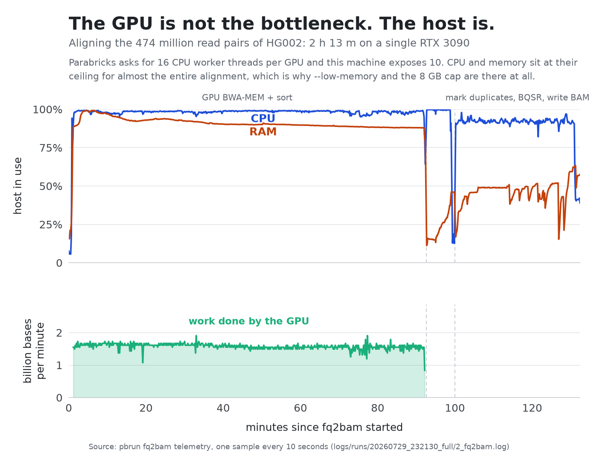

# A human genome on hardware you could actually own

NVIDIA Parabricks is a NVIDIA re-implementation of the GATK Best Practices, built
for data-centre with GPUs from the same company  . Its own
[installation requirements](https://docs.nvidia.com/clara/parabricks/get-started/installation-requirements)
say that running on a single GPU is *supported but not recommended*, and that a
single-GPU system should still meet the two-GPU requirement: **at least 100 GB of CPU RAM
and at least 24 CPU threads**.

This repository runs it on a gaming laptop with 32 GB of RAM and 12 threads,
driving one consumer GPU data over OcuLink through an external PCIe dock .

**HG002 whole genome, FASTQ to annotated VCF, in 10 h
31 m**, benchmarked against the Genome in a Bottle truth set at **F1 0.9921 for
SNPs and 0.9924 for indels**.


## The Hardware and Software I used 

|---|---|---|
| GPU | 1 × RTX 3090, 24 GB, OcuLink external PCIe dock | ≥ 16 GB GPU RAM, CUDA arch 75+ — **met** |
| Number of GPUs | 1 | single GPU "supported but not recommended" |
| System memory | 31.2 GB installed, 27 GB given to WSL2 | **≥ 100 GB** |
| CPU threads | 12 on the host, 10 exposed to WSL2 | **≥ 24** |
| Host OS | Windows 11, Ubuntu 24.04 under WSL2, Docker Desktop | Linux |

The GPU is the only part of this machine that meets the specification. Memory is
at 27 % of the requirement and threads at 42 %.

The laptop is a Lenovo Legion 5 15ARH7H with an AMD Ryzen 5 6600H — 6 cores, 12
threads. Its internal RTX 3060 is disabled so that exactly one GPU can make the calculations.

Operating with an under-specified on memory is not a detail you can ignore of course. It
needed further code optimizations.

:

- **`--low-memory` on `fq2bam`** drops BWA-MEM to a single stream.
- **`--memory-limit 8` and `--bwa-normalized-queue-capacity 2`** cap what the
  aligner may hold at once.
- **One container per phase, not one for the run.** BQSR is a separate `pbrun`
  invocation from `fq2bam` purely so the memory of the first is returned before
  the second starts.
- **`--htvc-low-memory` on HaplotypeCaller**, for the same reason.
- **Large intermediates live in a Linux Docker volume, never on `C:`.** An early
  attempt writing the BAM to a Windows-mounted path died with `Cannot allocate
  memory`. Only validated results are copied out at the end — and that copy is
  itself a 26-minute step, visible in the chart above.
- **64 GB of swap.** Not for speed: so that a spike costs minutes instead of
  killing a run that is eight hours in.

## Where the machine hit the limits

Parabricks samples its own resource use every ten seconds. Plotting the whole
alignment shows exactly which component is the limit:



The GPU analyzes 1.58 billion bases per minute while, across the 555
samples of that phase, **CPU use runs at 98.6 % and memory at 90 %, peaking at 99.3 %**  for an hour and a half without let-up.
`fq2bam` requests 16 CPU worker threads on a host that has 10 (2 are reserved for the base system). 


## The objective

The interesting question is not whether a 3090 beats a data-centre card. It is
whether is it possible to analyze an entire +30x genome locally ,  within reasonable time frame and accurately enough.


Measured on this machine:

| Work | GPU | CPU, 10 threads | |
|---|---|---|---|
| Align + sort + mark duplicates, 10 M read pairs | **3 m 25 s** | 24 m 56 s | **7.3×** |
| HaplotypeCaller, `chr20:1-20 Mb` at real ~35× depth | **2 m 02 s** | 9 m 38 s | **4.7×** |

And the two paths agree: of the 40,022 variant sites called in that region,
**40,020 are identical**  two found only by Parabricks, two only by GATK.
The speed is not bought with a different answer.

Extrapolated to the whole genome at the rates just measured : 149.6 µs per read
pair for alignment, 28.9 s per Mb for calling:

| | GPU, measured | CPU, projected |
|---|---|---|
| Alignment of all 474,384,500 pairs | 2 h 13 m | ≈ 19 h 43 m |
| HaplotypeCaller over 3.1 Gb | 4 h 38 m | ≈ 24 h 53 m |
| **The pipeline end to end** | **10 h 31 m** | **≈ 2 days** |

Treat the right-hand column as a floor rather than an estimate: `samtools sort`
and `MarkDuplicates` scale worse than linearly as the data grows, and chr20 is
not even the hardest 20 Mb in the genome. The take-home message is that the 3090 turns a
weekend job into an overnight one *on hardware which could not be used in the first place.

Method, so the comparison can be checked: `scripts/benchmark_cpu_vs_gpu.sh`.
Alignment is measured on a fixed subset of read pairs, because a CPU run of the
full genome would take more than a day of machine time; variant calling is
measured on a fixed region of the **full-coverage BAM the pipeline already
produced**, so the caller sees real ~35× depth rather than the thin coverage a
subset would give. Neither side applies BQSR, so what is compared is the caller
and nothing else. The CPU path is the ordinary Best Practices one  `bwa mem` |
`samtools sort`, then `gatk MarkDuplicates`, then `gatk HaplotypeCaller` — on all
10 threads WSL2 exposes.

## Does the output survive the constraint?

Accuracy is measured: `hap.py` v0.3.12 with the `vcfeval` engine
against **NIST HG002 GRCh38 v4.2.1**, restricted to the high-confidence BED
(3,365,127 SNPs and 525,469 indels over chr1–22).

| Type | Filter | Recall | Precision | F1 | False negatives |
|---|---|---|---|---|---|
| SNP | ALL | **99.26 %** | 99.16 % | **0.9921** | 24,740 |
| SNP | PASS | 98.06 % | 99.61 % | 0.9883 | 65,149 |
| INDEL | ALL | **99.19 %** | 99.29 % | **0.9924** | 4,238 |
| INDEL | PASS | 99.17 % | 99.38 % | 0.9928 | 4,340 |

For reference, a well-tuned GATK pipeline at this depth is generally taken to
reach about 0.995. The gap that remains sits in ordinary repeats and segmental
duplications, in residual multi-mapping, and plausibly in a BQSR known-sites set
limited to dbSNP alone , not in the hardware.

Supporting metrics, from the same run:

| | |
|---|---|
| Primary reads | 948,769,000 |
| Mapped / properly paired | 99.72 % / 97.84 % |
| Duplicates | 12.19 % — 5.86 M optical pairs out of 57.4 M; the rest is what sampling 472 M pairs from an estimated library of 1.95 B distinct molecules predicts, not PCR amplification |
| Effective coverage | 35.69× after removing duplicates, MAPQ < 20, BQ < 20 and overlapping mate bases |
| Breadth ≥ 20× | 92.52 % of the 2,923,716,080 non-N bases of chr1–22, X, Y |
| Variant records | 5,098,062 — Ti/Tv 1.929 |


| | Iteration 1 | Iteration 2 |
|---|---|---|
| Reference | `Homo_sapiens_assembly38.fasta` — 3,366 contigs, 261 `_alt`, no `.alt` file | `GCA_000001405.15_GRCh38_no_alt_plus_hs38d1` — 2,580 contigs, no `_alt` |
| Provenance key | `97bd8ce8` | `53007e55` |
| SNP F1 | 0.9814 | **0.9921** |
| INDEL F1 | 0.9837 | **0.9924** |
| Total runtime | 10 h 34 m | 10 h 31 m |

Iteration 1 reported SNP recall *below* indel recall — 96.97 % against 97.36 % —
which is backwards, since SNPs are the easy case. The cause was ALT contigs
carried without the companion `.alt` file. Without that file BWA cannot know that
a primary locus and an alternate scaffold are the same place, so it treats the
pair as ordinary multi-mapping and assigns MAPQ 0; HaplotypeCaller then discards
those reads below its default threshold of 20 and never calls the variants
underneath. Inside the MHC on chr6, recall was **1.49 %**.


Realigning against the no-ALT analysis set moved SNP recall from 96.97 % to **99.26 %**, false negatives from 101,963 to
**24,740**, and MHC recall from 1.49 % to **97.43 %**. The plan, its acceptance
criteria and its predictions were written *before* measuring and are in
[docs/iteration-2-plan.md](docs/iteration-2-plan.md); seven of nine predictions held
and the two that failed are documented there with the reason.

The fix was a trade: 77,223 recovered true positives arrived with
6,509 new false positives ( 11.9 true for every false ) and SNP precision fell
from 99.33 % to 99.16 %.

Two things the second run also settled:

- **The SNP hard filters cost more than they gain.** Going from ALL to PASS
  discards 40,409 true positives to remove 15,445 false ones (F1 0.9921 → 0.9883).
  SNP hard filters are now **off by default** in `scripts/postprocess.sh`; indel
  filters stay on, since there they help (0.9924 → 0.9928). The recommended call
  set is ALL. Set `HG002_SNP_HARD_FILTERS=on` to restore the old behaviour.
- **Checkpoints must be bound to their inputs.** Prefix and Docker volumes are
  derived from a provenance key — the first eight hex characters of a SHA-256
  over the Parabricks image ID, the SHA-256 of the reference `.fai`, the name and
  size of each FASTQ and of the known-sites file, the read group and the calling
  intervals. Before that, swapping in a new reference would have let the old BAM
  validate, alignment be skipped, and the pipeline report `PASS` while returning
  exactly the results it was supposed to replace. Every run also writes
  `logs/runs/<id>/run_manifest.json` listing the ingredients in plain text: a
  hash tells you that something changed, not what.

The preflight now also refuses to start on a reference carrying `_alt` contigs
without an `.alt` file beside it. That check costs nothing and would have caught
the defect at minute zero instead of ten hours in.

## What this call set is, and what it is not

This is a **benchmarked autosomal call set**. GIAB v4.2.1 covers chr1–22 inside
high-confidence regions and nothing else, so every accuracy figure above refers to the autosomal chromosomes but nothing
about X, Y, chrM, ALT contigs or decoys.


**Loss-of-function calls inside the MHC are not interpretable on a linear
reference.** Once the MHC is no longer blind it contributes 48 PASS + HIGH records
where the baseline had none, in HLA-DRB1, HLA-DRB5, MICA, HLA-A, HLA-B and
HLA-DQB1. Their technical quality is good, which is exactly what makes them
misleading: GRCh38 carries one arbitrary HLA haplotype and HG002's real alleles
differ from it enough that the caller describes the divergence as a pile of
frameshifts and stop-gains. HLA needs dedicated typing tools, or a pangenome
reference.

**The PASS + HIGH list is a technical shortlist**, 762 records, with no genotype
threshold applied and no ACMG/AMP classification. It does not mean pathogenic.
Hard filters and snpEff are technical controls, not clinical interpretation, and
the snpEff hg38 database in use (5.1d, 2020) is out of date for anything
resembling interpretation.

## Running it

Open PowerShell in the project directory.

```powershell
.\Start-HG002.ps1 -PreflightOnly    # checks only, no analysis
.\Start-HG002.ps1 -SmokeTest        # end-to-end trial, about 6 minutes
.\Start-HG002.ps1                   # full run, about 10 h 30 m
.\Watch-HG002.ps1                   # follow the live log, read-only
.\Get-PipelineStatus.ps1 -Watch     # checkpoints, durations, resources
.\Stop-HG002.ps1                    # controlled shutdown
```

The pipeline resumes from any checkpoint that passes validation, and a file is
never treated as valid merely because it exists — see
[docs/pipeline-validation-20260725.md](docs/pipeline-validation-20260725.md),
where deliberately truncated copies are rejected.

`Start-HG002.ps1` registers a Windows scheduled task rather than running in the
foreground, so a ten-hour run survives the terminal closing and the network
dropping. That matters because the machine is normally driven remotely, over
Tailscale with OpenSSH and VS Code Remote with another laptop; `Setup-RemoteAccess.ps1` configures the
host side. `Watch-HG002.ps1` only reads the log, so `Ctrl+C` detaches the reader
and leaves the analysis running.

Two separate measurement scripts, both re-runnable:

```bash
bash benchmark_giab.sh                  # accuracy against GIAB, PREFIX=<prefix>
bash scripts/benchmark_cpu_vs_gpu.sh    # CPU vs GPU on this machine
```

Figures are regenerated from the logs and result files, never edited by hand:

```bash
docker run --rm --mount "type=bind,source=$PWD,target=/w" \
    --env PYTHONPATH=/w/.python-packages-linux \
    bioinfo-codeserver:latest python /w/scripts/make_figures.py
```

## How the code is organised

- `run_parabricks_hg002.sh` — the main script;
- `scripts/pipeline_functions.sh` — Docker orchestration, checkpoints, provenance;
- `scripts/postprocess.sh` — filtering, annotation and QC metrics;
- `scripts/generate_report.py` — HTML report and JSON summary;
- `scripts/fetch_reference_noalt.sh` — downloads and verifies the no-ALT reference;
- `scripts/benchmark_cpu_vs_gpu.sh` — the CPU/GPU measurement above;
- `scripts/make_figures.py` — every figure in this README, plus the square
  summary card in `docs/figures/`;
- `benchmark_giab.sh` — accuracy benchmark, run separately at the end;
- `Start-HG002.ps1`, `Stop-HG002.ps1`, `Get-PipelineStatus.ps1`,
  `Watch-HG002.ps1`, `Setup-RemoteAccess.ps1` — Windows-side launcher, shutdown,
  monitor, log follower and one-off remote-access setup;
- `docs/data-sources.md` — provenance and download URLs for every input file;
- `docs/iteration-2-plan.md` — the plan of the second iteration, with its
  predictions written before the measurements that tested them.

The FASTQ files, the reference, the databases and the outputs are excluded by
`.gitignore` . the two FASTQ are 34 and 35 GB, the BAM is 92 GB. What is published
is the code, the documentation and the small result files.

## Stated limitations

- BQSR uses the dbSNP set included in the project, not the full known-sites
  bundle from the Broad Best Practices.
- Ti/Tv inside the GIAB scope is 1.9591 for ALL against 2.10 in the truth set.
  Now that most missing true SNPs have been recovered and the ratio has barely
  moved, the gap points at false positives in hard regions.
- The "40×" in the dataset name is the publisher's label. The
  effective coverage is 35.69×.
