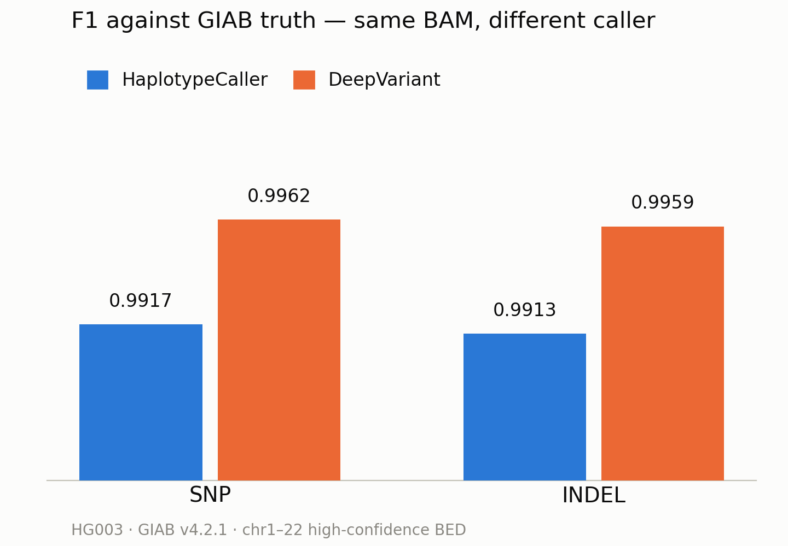
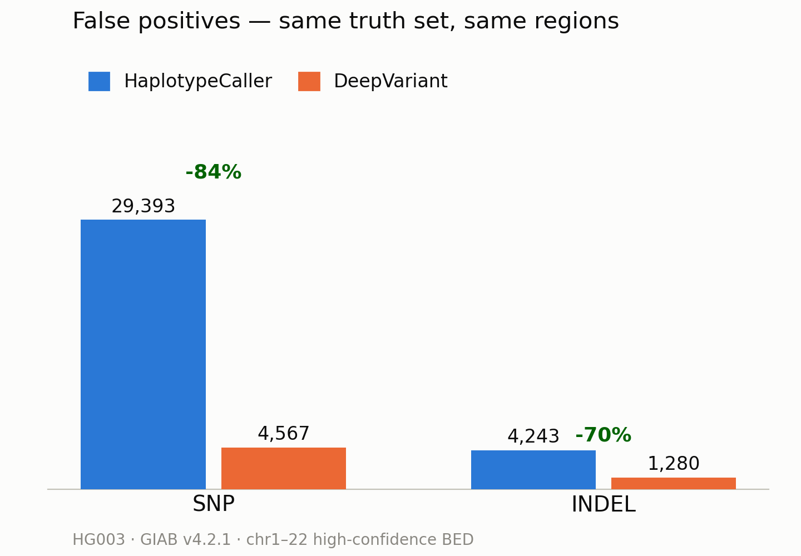
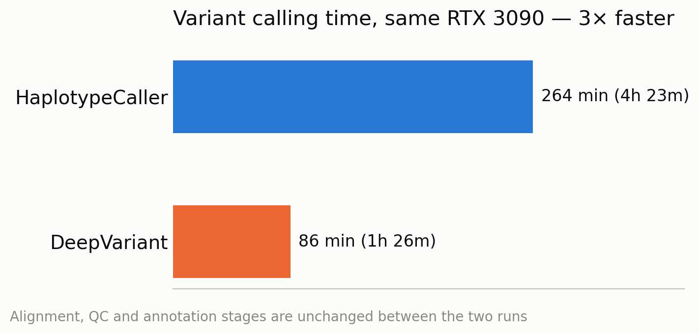
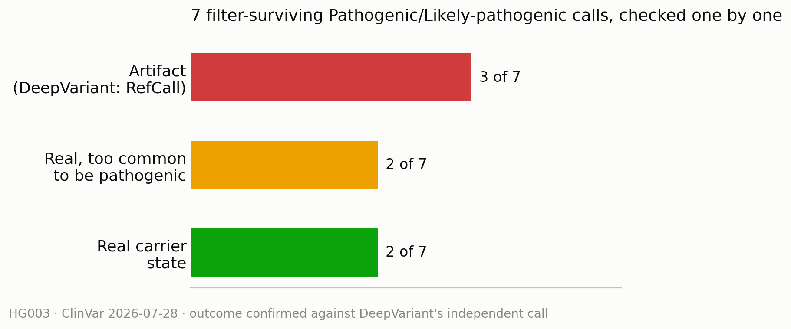

# DeepVariant vs. GATK HaplotypeCaller on HG003 — a clean rematch

**Sample**: HG003 / NA24149, GIAB Ashkenazim trio (father), Illumina NovaSeq PCR-free 35x
**Same BAM, same truth set, same BED — the only variable is the variant caller.**
**Full interactive report (Italian)**: [`report.html`](report.html)

This uses the same germline pipeline as the rest of this repository, run
against a second GIAB sample, with one extra step: [`run_deepvariant.sh`](run_deepvariant.sh)
calls DeepVariant on the same BAM HaplotypeCaller already produced, so the
two callers are compared on identical input. Raw hap.py evidence for both
runs is under [`giab/`](giab).

## Why HG003, and not HG002 again

This project already evaluated DeepVariant once, for the main HG002 run, and
dropped the comparison: Google's public DeepVariant WGS model is trained on
GIAB samples HG001–HG007 *except HG003*. Benchmarking it against HG002 would
have graded it on data it had already seen. HG003 is the one genome in the
trio it never trained on — the only fair ground for this test.

## Accuracy against GIAB v4.2.1 (hap.py / vcfeval, chr1–22 high-confidence BED)

| Metric | HaplotypeCaller | DeepVariant | Δ |
|---|---:|---:|---:|
| SNP recall | 0.9922 | 0.9937 | +0.0015 |
| SNP precision | 0.9912 | 0.9986 | +0.0074 |
| SNP F1 | 0.9917 | 0.9962 | +0.0045 |
| INDEL recall | 0.9906 | 0.9942 | +0.0036 |
| INDEL precision | 0.9919 | 0.9976 | +0.0057 |
| INDEL F1 | 0.9913 | 0.9959 | +0.0046 |

Both classes improve on both axes at once — usually precision gains cost
sensitivity, not here. Full numbers: [`giab/haplotypecaller/giab_benchmark.json`](giab/haplotypecaller/giab_benchmark.json),
[`giab/deepvariant/giab_benchmark.json`](giab/deepvariant/giab_benchmark.json).

| Errors (absolute) | HaplotypeCaller | DeepVariant | Change |
|---|---:|---:|---:|
| SNP false positives | 29,393 | 4,567 | −84.5% |
| SNP false negatives | 25,832 | 20,985 | −18.8% |
| INDEL false positives | 4,243 | 1,280 | −69.8% |
| INDEL false negatives | 4,744 | 2,932 | −38.2% |

DeepVariant reports ~230,000 fewer `PASS` variants overall, which looks like
a red flag until you check it against ground truth: inside the judged
regions it removes ~25,000 wrong SNPs and adds ~4,800 right ones. Two
independent, non-F1 indicators agree with the direction: GIAB's known
het/hom ratio is 1.535 (HaplotypeCaller 1.670, DeepVariant 1.447), and the
expected Ti/Tv is 2.103 (HaplotypeCaller 1.962, DeepVariant 1.979).

## Runtime

Variant calling: **86 min (DeepVariant) vs. 4h 24m (HaplotypeCaller)** on the
same RTX 3090 — about **3x faster**, not the predicted outcome since
DeepVariant does more per-site work (pileup images + CNN inference). The gain
comes from GPU parallelism that HaplotypeCaller barely uses. DeepVariant also
needs no BQSR and no hard filtering, removing two pipeline stages worth ~18
more minutes.

## The clinical stress test

ClinVar annotation surfaced 7 filter-surviving Pathogenic/Likely pathogenic
calls. Checking each against DeepVariant's independent call:

- **3 are artifacts** — DeepVariant marks them `RefCall`.
- **2 are real but too common to be pathogenic** — CDKN2B (79% population
  frequency), XG (37%).
- **2 are genuine heterozygous carrier states**, consistent with the donor's
  Ashkenazi origin.

One artifact, **PRSS1** (chr7:142750561 C>T), was reported as a confirmed
pathogenic variant by an online source with matching rsID and protein
change. `MQRankSum = −6.02` is the text signature of systematic mismapping
in the ALT-supporting reads — stronger than the same signal on SLC9B1, which
that source correctly flagged as false. The region also overlaps the TRB
locus, which is somatically rearranged in blood-derived DNA. None of this
project's active hard filters check MQ or MQRankSum on indels; DeepVariant
rejects the call independently, without needing to.

## Takeaways

- DeepVariant replaces HaplotypeCaller with no tradeoff here: better recall
  *and* precision on both variant classes, 3x faster, same hardware.
- Hard filtering and VQSR become moot: DeepVariant's unfiltered precision
  (0.9986) beats HaplotypeCaller's best filtered result. Its `ALL` and
  `PASS` benchmark rows are identical.
- If DeepVariant becomes the pipeline's caller, its name has to enter the
  provenance key that names checkpoints and volumes — it doesn't yet, so a
  caller swap today would silently reuse and report the previous caller's
  checkpoints as success.
- The benchmark still only judges chr1–22 inside the high-confidence BED:
  `Frac_NA` shows 13% of called SNPs and 44% of called indels aren't judged
  at all, and chrX/chrY/chrM have no truth set here.
- No population-frequency filter yet: without gnomAD, common variants like
  CDKN2B and XG still enter the clinical table.

---
*Truth set NIST/GIAB v4.2.1 for HG003 (NA24149), GRCh38, chr1–22
high-confidence regions. Reference GCA_000001405.15, no ALT contigs, hs38d1
decoy. ClinVar release 2026-07-28. HG003 is a public reference sample;
reported variants are not a clinical interpretation.*
